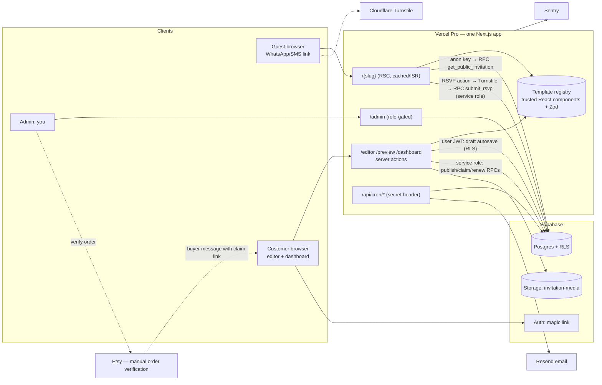

# PixelBridge Invites — Phase 1: Architecture & Foundation

Status: draft for your review. Items marked **VERIFY** depend on current third-party terms/prices that I did not check. Items marked **ASSUMPTION** are my defaults; change them if you disagree.

---

## 1. Architecture Decision Record

| # | Decision | Rationale | Alternatives rejected |
|---|----------|-----------|-----------------------|
| 1 | **One Next.js (App Router, TS) app serves marketing, editor, dashboard, admin and all public invitations.** | Multi-tenant by data, not deploys. Template changes ship once. | Per-customer deploys (unmanageable), separate editor app (needless split for MVP). |
| 2 | **Public invitations at `/{slug}`**, on subdomain `invite.pixelbridge.com`. Reserved slugs blocked in DB. | Matches your spec; subdomain isolates cookies/CSP from the main brand site. | Path prefix `/i/{slug}` is safer against route collisions but uglier to share. Revisit only if reserved-word list becomes painful. |
| 3 | **Draft/published split.** `invitation_content.draft` (owner-editable) vs `published` (immutable snapshot written only by a server-side function). The public path reads *only* `published`. | Drafts can never leak; "preview before publish" and "unpublish" are trivial; revisions give undo. | Single content column + status flag (one bug leaks a draft). |
| 4 | **Anon has zero table access.** Public pages call one `SECURITY DEFINER` RPC (`get_public_invitation`). | No RLS mistake can expose RSVPs/orders to the public. Service-role key not needed on the read path. | Public SELECT policy on `invitations` (fragile column exposure). |
| 5 | **Auth: Supabase Auth, email magic link / OTP only (no passwords).** Fulfilment uses a **one-time claim link** `/claim/{token}`: admin creates invitation, token (256-bit, SHA-256 hashed in DB, 14-day expiry, single use, revocable) is sent via Etsy messages; buyer opens it, signs in with *any* email they choose, and becomes owner. | Etsy buyer emails may be unavailable or differ from the buyer's preferred email; no long-lived secret in a URL; ownership is tied to a real account that can recover access by email. | Permanent "secret edit URL" (leaks via history/forwarding, no recovery). |
| 6 | **Plan features are data** (`plans.features`), enforced at publish by stripping disallowed sections from the snapshot, *and* at render (registry ignores sections not in `features`), *and* in editor UI. | Never advertise/unlock what isn't implemented; UI hiding is not security. | Hard-coded plan checks scattered in components. |
| 7 | **Template registry** maps `"{slug}@{version}"` → trusted React component + Zod content schema. Invitations pin `template_version`; old versions stay in the registry until no invitation uses them. | Backward-compatible updates; no customer JS/HTML ever executed. Rich text = restricted plain text with line breaks only. | MDX/HTML content (XSS surface). |
| 8 | **Writes:** autosave of `draft` uses the user's JWT + RLS (column grant limits it to `draft`, size-capped, optimistic `draft_version`). **Publish, unpublish, claim, RSVP, renewal** are service-role-only SQL functions called from server actions *after* Zod validation; each function re-checks actor ownership inside SQL. Render path re-validates snapshots with Zod `safeParse`. | A user hitting PostgREST directly can only scribble in their own draft; it can't reach the public without server validation. Defense in depth. | Doing everything via service role (one authz bug = full breach). |
| 9 | **RSVP**: server action → Cloudflare Turnstile + honeypot → Postgres rate limit (`hit_rate_limit`, keyed on HMAC of IP, never raw IP) → `submit_rsvp`. Client sends an idempotency key; UI shows success only after a confirmed server `ok:true`. | Spam resistance without a paid service; duplicate taps are safe. | Upstash/Redis (extra paid service for no MVP benefit). |
| 10 | **Media:** public-read Supabase bucket, UUID paths, owner-only write by folder policy, 5 MB / jpeg-png-webp limit. Server re-encodes to WebP (strips EXIF/GPS) before storing. | Simple CDN delivery with `next/image`. Draft photos are only guessable by 122-bit UUID. | Private bucket + signed URLs (breaks caching/OG images; revisit if clients upload sensitive images). |
| 11 | **Styling: Tailwind + hand-written CSS for the envelope animation** (CSS transforms/`clip-path`, no animation library). Reduced-motion → skip straight to content. | Fewest dependencies; compositor-only animation is smooth on low-end phones. | Framer Motion / GSAP (bundle weight). |
| 12 | **Hosting lifecycle** (**ASSUMPTION**): term = 12 months from **first publish** (unpublished entitlements expire 6 months after purchase — to be implemented in Phase 6). Then: `active → grace` (+14 days, page still visible with owner-only banner) `→ suspended` (page shows neutral "no longer available") `→ archived` at +90 days (data kept; owner can renew or export) → deletion only after +365 days **with admin confirmation and a final email**. | No surprise deletion; weddings are dated so most value is front-loaded. | Delete on expiry day (explicitly rejected). |
| 13 | **Etsy fulfilment is manual in v1.** Admin form: record Etsy order ref → verify → pick plan → create invitation + claim token → paste into Etsy message. No Etsy API use until officially confirmed (**VERIFY**). | Matches your brief; zero policy risk from automation. | Scraping / unofficial APIs (rejected). |
| 14 | **Jobs:** Vercel Cron → authenticated route handler → `advance_hosting_lifecycle()` and reminder email sender (Resend free tier). | No extra infra. | pg_cron (fine too; but email sending needs app code anyway). |
| 15 | **Testing:** Vitest (unit + Zod schemas), pgTAP or Vitest-against-local-Supabase for RLS tests, Playwright for E2E (mobile + desktop, reduced-motion project). | RLS is the highest-risk layer; it gets real tests, not mocks. | — |

### Plan/feature conflict I found in your brief (needs your decision)
Section 9 lists "Map or directions link" under **Essential**, while the pricing says "Venue map" is **Signature**. **ASSUMPTION:** Essential = plain "Get directions" link to the venue URL; Signature = styled map card. Encoded as `map_card` flag. Also: **Personalized Setup** has no stated feature set; I defaulted it to Signature without RSVP.

---

## 2. System architecture



**Request flows**
- *Guest view:* `/{slug}` → RPC → `{status, template, content}` → registry component → HTML. `published` → cached with tag `inv:{slug}`; publish/unpublish call `revalidateTag`. Non-published → generic page, `noindex`, HTTP 404/410.
- *Edit:* browser → server action (session check) → user-JWT update of `draft` with `draft_version` check → returns new version; client keeps unsaved changes in localStorage and retries on failure.
- *Publish:* server action → load draft → Zod validate → strip by plan → `publish_invitation(actor, id, snapshot)` → revalidate.
- *Fulfil:* admin verifies order → `orders` row → create invitation + pending entitlement + claim token → you paste link in Etsy message → buyer redeems.

---

## 3. Folder structure

```
pixelbridge-invites/
├─ app/
│  ├─ (marketing)/page.tsx, help/, privacy/, terms/
│  ├─ (auth)/login/, claim/[token]/
│  ├─ (customer)/dashboard/, dashboard/[id]/rsvps/, editor/[id]/, preview/[id]/
│  ├─ admin/ (orders, invitations, abuse, audit)
│  ├─ api/cron/lifecycle/route.ts, api/cron/reminders/route.ts, api/rsvp/export/[id]/route.ts
│  ├─ [slug]/page.tsx, [slug]/opengraph-image.tsx, layout.tsx
├─ components/ui/, components/editor/, components/invitation/ (Envelope, Countdown, Gallery, RsvpForm…)
├─ templates/
│  ├─ registry.ts                      # "{slug}@{version}" → { Component, schema, defaults, features }
│  └─ ivory-burgundy/v1/ (index.tsx, schema.ts, defaults.ts, styles.css, editor-fields.ts)
├─ lib/
│  ├─ supabase/ (browser.ts, server.ts, admin.ts [server-only])
│  ├─ schemas/ (content.ts, rsvp.ts, slug.ts, url.ts)   # shared Zod
│  ├─ plans.ts, lifecycle.ts, rate-limit.ts, turnstile.ts, images.ts, qr.ts, audit.ts, csv.ts, safe-redirect.ts
├─ supabase/
│  ├─ migrations/0001_initial_schema.sql
│  ├─ seed.sql, config.toml, tests/ (pgTAP RLS tests)
├─ tests/unit/, tests/e2e/ (playwright.config.ts: mobile-safari, chromium, reduced-motion)
├─ docs/ (this file, policies/hosting-terms.md, runbooks/*.md, privacy-notice.md)
├─ middleware.ts                        # session refresh, /admin & /editor gating, security headers
├─ .env.example
```

---

## 4. Database schema

Full SQL: [`supabase/migrations/0001_initial_schema.sql`](../supabase/migrations/0001_initial_schema.sql).

**Entities:** `profiles`, `plans`, `templates`, `orders`, `invitations`, `invitation_content` (draft/published JSONB), `invitation_revisions`, `invitation_media`, `hosting_entitlements`, `edit_claims`, `rsvp_responses`, `rate_limits`, `audit_log`, `abuse_reports`, `reserved_slugs`.

**JSONB vs columns:** structured & security-relevant (slug, status, owner, plan, template pin, event timestamp, time zone, entitlement dates) are columns. Template-specific copy/theme/schedule/links/RSVP config live in `draft`/`published` JSONB, validated by the template's Zod schema (names, headline, venue, map URL, schedule[], dress code, colors, font keys, gallery refs, rsvp `{enabled, deadline, max_party, collect_contact, collect_dietary}`, registry links).

**Not yet in migration (deliberately, Phase 6):** reminder email log, retention purge job, data-export function. **Not tested yet:** the SQL has not been executed against a database. First step of Phase 3 is `supabase start` + pgTAP tests; expect small fixes.

---

## 5. Security & access-control model

| Actor | Can | Cannot |
|-------|-----|--------|
| **Guest (anon)** | Call `get_public_invitation`; read active plans/templates; submit RSVP *through the server action* | Read any table; read drafts; read RSVPs; call write RPCs (not granted) |
| **Customer** | Read own profile/orders/invitations/content/media/entitlements/RSVPs; update **only** own `profiles.name`, own `invitation_content.draft`, own media rows; delete own RSVPs; publish/unpublish *own* invitation via server action | Change role, owner, slug, plan, status, `published`, entitlement dates; see other tenants' rows |
| **Admin** | Read all; all mutations via audited server actions/RPCs | Bypass audit log (append-only: no UPDATE/DELETE grant) |
| **service_role** | Server-only (`lib/supabase/admin.ts`, `import "server-only"`) | Never shipped to browser; never used in a request path without prior authz check |

**Controls checklist**
- RLS on every table; default privileges revoked; column-level UPDATE grants (`name`, `draft`).
- `SECURITY DEFINER` functions use `set search_path = ''`; write functions callable by `service_role` only and re-verify actor in SQL.
- Claim tokens: 256-bit random, hash-only storage, expiry, single-use, revocation, audit entry on issue/redeem. Raw token shown once.
- Slugs: regex + length + reserved list + unique index; profanity/impersonation review is a manual admin step.
- URLs (map, registry, redirect `?next=`): Zod allowlist of `https:` only; internal redirects must start with `/` and not `//`. Rendered with `rel="noopener noreferrer"`.
- No `dangerouslySetInnerHTML` with customer data. Text rendered by React (escaped). JSON-LD built via `JSON.stringify` with `<` escaped.
- CSP (nonce-based), `X-Content-Type-Options`, `Referrer-Policy: strict-origin-when-cross-origin`, `frame-ancestors 'none'` on editor/admin; Turnstile and map-embed origins explicitly allowed (if iframe map is used, prefer a link-out card to avoid third-party frames in MVP).
- CSRF: Next.js server actions enforce Origin checks; cookie `SameSite=Lax`; CSV export is a GET behind auth with `Content-Disposition` and formula-injection neutralisation (prefix `'` for cells starting with `= + - @`).
- Uploads: MIME sniffing server-side (not extension), re-encode with `sharp`, cap 5 MB / 4000 px, strip metadata, random filenames.
- Rate limits: RSVP (e.g. 5/10 min per IP+invitation, 100/day per invitation), magic-link requests, claim attempts, abuse form.
- Secrets only in Vercel/Supabase env; `.env.local` git-ignored; secret scanning in CI.
- Backups: Supabase Pro daily backups (**VERIFY** retention/PITR is add-on); quarterly restore drill documented in runbook.
- Privacy: RSVP data collected = name, attendance, count, optional contact/dietary/message. Visible only to the invitation owner and (for support/abuse) admin. Retention (**ASSUMPTION**): RSVPs deleted 90 days after event date unless owner exports/deletes sooner; owner can delete any time. IP never stored (HMAC bucket, rotating salt).

---

## 6. Environment variables & external accounts

| Variable | Scope | Purpose |
|----------|-------|---------|
| `NEXT_PUBLIC_SITE_URL` | public | Canonical base URL (OG tags, QR codes, redirects) |
| `NEXT_PUBLIC_SUPABASE_URL` | public | Supabase project URL |
| `NEXT_PUBLIC_SUPABASE_ANON_KEY` | public | Anon/publishable key (RLS-protected) |
| `SUPABASE_SERVICE_ROLE_KEY` | **server only** | Privileged RPCs, cron |
| `NEXT_PUBLIC_TURNSTILE_SITE_KEY` / `TURNSTILE_SECRET_KEY` | public / server | RSVP + abuse form bot protection |
| `RATE_LIMIT_SALT` | server | HMAC key for IP bucketing (rotate monthly) |
| `CRON_SECRET` | server | Authenticates cron route handlers |
| `RESEND_API_KEY`, `EMAIL_FROM` | server | Reminders, support mail (custom-domain SPF/DKIM/DMARC required) |
| `SENTRY_DSN` (+ `SENTRY_AUTH_TOKEN` in CI) | public/CI | Error monitoring |
| `ADMIN_BOOTSTRAP_EMAIL` | server | One-time seed of your admin profile (role set via SQL, never via UI) |

Use **separate Supabase projects and Vercel environments** for dev / preview / production; never point previews at production data.

**Accounts needed:** GitHub; Vercel **Pro** (Hobby forbids commercial use — **VERIFY** current terms); Supabase (**Pro** for production: backups, no pause — **VERIFY**); domain registrar/DNS (e.g. Cloudflare); Cloudflare Turnstile; Resend; Sentry; Etsy seller account; (later) business bank/payments for renewals and a tax setup.

---

## 7. Prioritized MVP checklist

**P0 — Prove the concept (Phase 2)**
- [ ] Envelope + invitation page prototype as static Next page, real mobile device testing (iOS Safari, Android Chrome), reduced-motion path, no-JS fallback showing event details.
- [ ] Live demo URL you can put in the listing (with clearly fictional couple).

**P1 — Core (Phases 3–4)**
- [ ] Supabase project, migration applied, RLS/pgTAP tests passing
- [ ] Auth (magic link), claim flow, profiles
- [ ] Template registry + `ivory-burgundy@1` + Zod schema
- [ ] Editor: names, date/time/timezone, venue, links, dress code, info, colors, 3–4 font pairs, autosave + conflict handling, preview, publish/unpublish, copy link, QR
- [ ] Image upload + order + alt text
- [ ] Schedule + countdown + gallery (Signature)
- [ ] Hosting entitlement activation at publish; expiry banner
- [ ] OG metadata (`noindex` on all invitations — private events)

**P2 — RSVP (Phase 5)**
- [ ] Form + idempotency + honest failure states, Turnstile, rate limit
- [ ] Owner dashboard, CSV export, delete response
- [ ] Privacy notice shown on form

**P3 — Operations (Phase 6)**
- [ ] Admin: order verify, provision, issue/revoke claim, suspend/unsuspend, renew, audit view, abuse queue
- [ ] Cron: lifecycle + 30d/7d/expired reminders
- [ ] Runbooks: renewal, unpublish, refund, restore edits, delete data, abuse

**P4 — Launch gates (Phase 7)**
- [ ] Legal pages reviewed by a qualified person; Etsy policy check; production backups verified by restore; full test plan from your §15 green.

**Explicitly deferred:** payments in-app, Etsy API automation, multiple templates, multi-language, custom domains per customer, guest-specific personalised links, email invitations sending.

---

## 8. Risks & decisions to resolve before production

| # | Risk / decision | Why it matters | Action |
|---|-----------------|----------------|--------|
| 1 | **Etsy listing eligibility for a hosted service.** Etsy rules for digital items, what must be delivered (typically a file), and "seller-created" requirements. **VERIFY** | Listing removal or account suspension would kill the channel. | Read current Seller Policy, Creativity Standards, digital-item rules; plan delivery as a PDF/instructions file containing the setup link; keep screenshots of the real product. |
| 2 | **Renewals outside Etsy.** Collecting renewal payments off-platform may conflict with Etsy's fee/off-platform rules. **VERIFY** | Policy violation risk. | Safest: sell "Hosting renewal" as a separate Etsy listing; only add direct payments if policy allows. |
| 3 | **Hosting promise vs. wedding timelines.** 12 months from first publish is generous for single-date events and a recurring cost. | Margin and support. | Confirm term definition; consider 6–9 months for Essential. |
| 4 | **Unit economics are unproven** (Etsy/payment fees, Vercel/Supabase seat costs, support time per order ≈ ?). | Essential at $24 may be thin after fees and 1–2 support messages. | Build model in the Phase 7 workbook; I will use clearly labelled assumptions, no invented demand. |
| 5 | **Privacy law**: RSVP data of guests (UK/EU GDPR, CA PIPEDA/Quebec Law 25, US state laws). You are the processor for hosts or arguably a controller for the platform. Children's events add heightened rules. | Fines/trust. | Decide controller/processor posture; DPA with Supabase/Vercel; privacy notice + retention; **legal review before launch**. Do not claim compliance until reviewed. |
| 6 | **Vercel/Supabase terms and pricing** (commercial use, bandwidth, image optimisation costs). **VERIFY** | Surprise bills. | Spend caps/alerts; use `next/image` sizing carefully; WebP pre-resize. |
| 7 | **Abuse**: platform could host scam/harassing/illegal pages. | Account/domain reputation. | Report link on every page, suspension runbook, slug review, ToS clause. |
| 8 | **Email deliverability** for magic links/reminders. | Customers locked out. | Custom-domain SPF/DKIM/DMARC; fallback admin-issued new claim link. |
| 9 | **Brand/trademark and domain** (`invite.pixelbridge.com` requires owning pixelbridge.com; "PixelBridge" trademark clearance). | Rebrand cost. | Confirm domain control before building. |
| 10 | **Bus factor / support load**: you are the only admin and support. | Wedding deadlines are time-sensitive. | Define support hours and SLA in the listing. |
| 11 | **Tax**: VAT/GST/sales tax on digital services handled mostly by Etsy for Etsy sales; direct renewals are your responsibility. **VERIFY** | Compliance. | Accountant check. |
| 12 | **Unexecuted SQL** | Syntax/behaviour bugs likely. | Run + test in Phase 3 first task. |

---

## Questions I need answered (only the essential ones)
1. Do you own `pixelbridge.com` (or whatever domain) and is "PixelBridge" cleared for use?
2. Confirm or change: hosting term starts at **first publish**; grace 14 d / archive 90 d / deletion 365 d.
3. Personalized Setup: Signature features, or include RSVP?

If I hear nothing I proceed with the assumptions above.

## Completed / outstanding
- Done: ADR, architecture, structure, schema draft, security model, env list, MVP list, risks.
- Next (Phase 2): static visual prototype of the envelope + invitation (Next.js scaffold), tested on mobile viewports and reduced motion.
